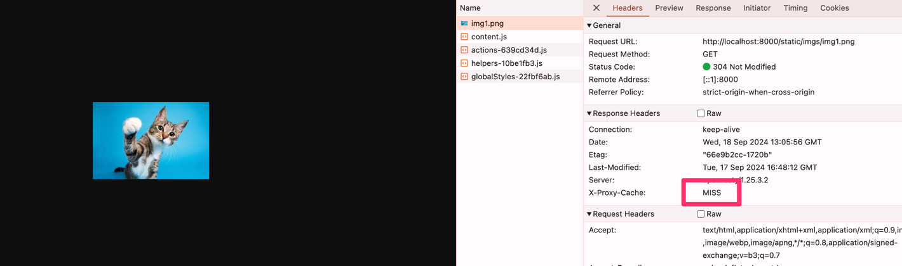
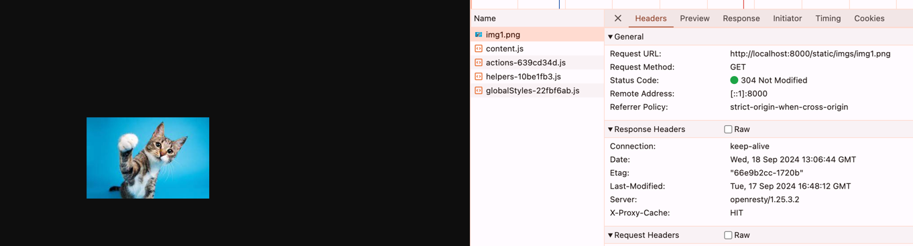
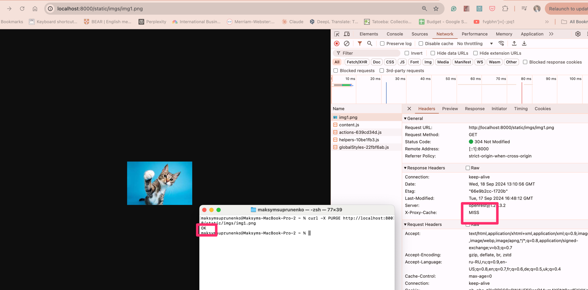

```
```
curl -X GET http://localhost:8000/static/imgs/img1.png

# Cached image returns after 3 ping

```
proxy_cache_min_uses 2;
```




# Purge
Purge picture via curl
```commandline
curl -X PURGE http://localhost:8000/static/imgs/img1.png
```
```nginx configuration
if ($request_method = PURGE) {
    set $lua_purge_path "/var/cache/nginx";
    set $lua_purge_levels "1:2";
    set $lua_purge_upstream "http://nginx:10010";
    content_by_lua_block {require("purge").purge_static()}
}
```

